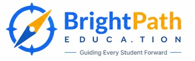

<h1 align="center">BrightPath Education</h1>

<p align="center">
	
</p>

BrightPath Education is a full-stack student and course management app with a Django REST backend and a Nuxt frontend.

## Quick Start

### Backend

1. Go to `backend/`.
2. Copy `.env.example` to `.env` and fill in the required values.
3. Start the API:

```bash
docker compose up --build -d
```

The backend will be available at `http://localhost:8000/api/`.

### Frontend

1. Go to `frontend/`.
2. Copy `.env.example` to `.env`.
3. Install dependencies and start the app:

```bash
npm install
npm run dev
```

The frontend will be available at `http://localhost:5173`.

## Documentation

For more details, see:

- [Backend README](./backend/README.md)
- [Frontend README](./frontend/README.md)
